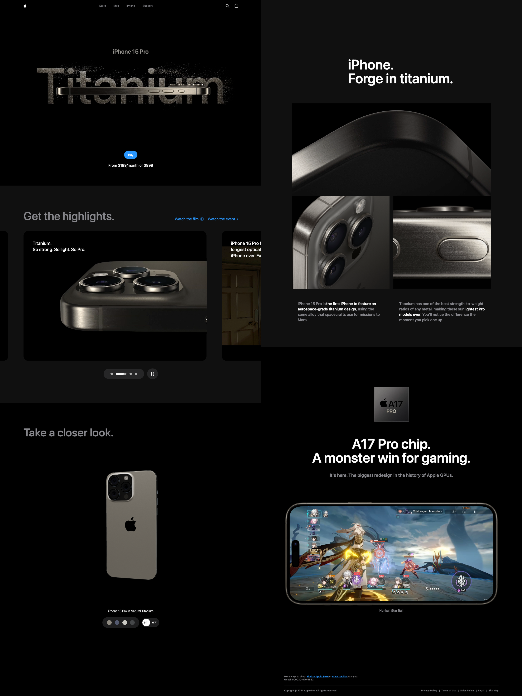

<div align="center">

# 🚀 iPhone 15 Website Clone — Apple-Inspired Interactive Landing Page

A beautifully animated, fully responsive clone of Apple’s iPhone 15 product page, built with modern web tools like React, Vite, GSAP, and Three.js.

</div>

---

<div align="center">

### 🛠 Built With

[](https://reactjs.org/)
[](https://vitejs.dev/)
[](https://tailwindcss.com/)
[](https://greensock.com/gsap/)
[](https://threejs.org/)

</div>

---

## 🧠 Overview

**iPhone 15 Website Clone** is a fully responsive and animated landing page that replicates Apple’s iPhone 15 product site.  
It features smooth scroll-triggered animations, 3D model interaction, and pixel-perfect UI built with modern tools like React, Tailwind CSS, GSAP, and Three.js.

Inspired by [JavaScript Mastery](https://www.youtube.com/@javascriptmastery), this project is ideal for developers who want to practice advanced front-end techniques and build high-performance, animation-rich websites.

---

## 📸 Demo



---

### 🔍 Highlights

- ✅ Responsive design
- ✅ Smooth animations and transitions
- ✅ Reusable UI components
- ✅ Content-managed sections
- ✅ Scalable, modular codebase
- ✅ Beautiful visuals and interactive elements

---

## ✨ Features

- 🎯 Seamless scroll-based animations using GSAP
- 🧩 Real-time 3D interactions with Three.js and react-three-fiber
- 📝 Clean, modular React component architecture
- 📱 Fully responsive layout for mobile and desktop
- 🎨 Tailwind CSS utility-first styling for custom design
- 🧠 Inspired by Apple’s high-performance UI approach

---

## 🛠️ Tech Stack

- **Frontend:** React, Vite, Tailwind CSS
- **Animations:** GSAP (GreenSock Animation Platform)
- **3D Models:** Three.js, @react-three/fiber
- **State Management:** useState, useRef
- **Error Monitoring:** Sentry.io

---

## 📦 Project Structure

```bash
📁 public/               # Static assets (images, videos, demo screenshot)
📁 src/
├── assets/             # Imported images, icons, videos
├── components/         # Reusable React components (Navbar, Hero, Footer, etc.)
├── utils/              # Animation utilities and helpers
├── constants/          # Static data like nav links, models, and videos
├── App.jsx             # Main app component
├── main.jsx            # Vite entry point
📄 index.css            # Global Tailwind styles
📄 index.html           # HTML entry file
📄 vite.config.js       # Vite configuration
📄 tailwind.config.js   # Tailwind configuration
```

---

## 🚀 Installation & Usage

### 1️⃣ Clone the Repository

```bash
git clone https://github.com/Oran01/iPhone-Website-Clone.git
cd iPhone-Website-Clone
```

### 2️⃣ Install Dependencies

```bash
npm install
```

### 3️⃣ Run the Project

```bash
npm run dev
```

🔹 The website will be available at **<http://localhost:5173>** (or another available port).

---

## 📺 Tutorial Source

This project was built following the **JavaScript Mastery** tutorial:
🎥 [YouTube Video](https://www.youtube.com/watch?v=RbxHZwFtRT4&t=14266s)

---

## 📝 License

This project is for educational purposes only and should not be used for commercial applications.

---

## 🤝 Credits

- **JavaScript Mastery** for the original tutorial.
- **GSAP & Three.js teams** for the amazing animation and 3D libraries.

⭐ If you enjoyed this project, please consider giving it a star!
